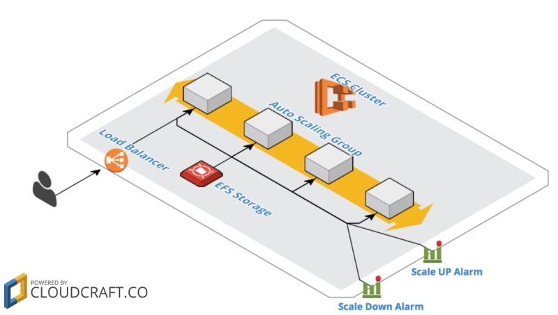

# AWS - Terraform for Jenkins (ECS)  
Terraform files used for orchestrating resources to host a scalable and self-healing Jenkins environment using ECS in AWS.  

For the entire backstory, see the following great tutorial: [Chapter 4, Run Jenkins Infrastructure on AWS Container Service](https://tech.ticketfly.com/our-journey-to-continuous-delivery-chapter-4-run-jenkins-infrastructure-on-aws-container-service-ef37e0304b95).  

They created basically everything using CloudFormation. I mostly just translated their work to Terraform. Then I added various features, such as a self-healing bastion instance, support for HTTPS using the elastic load balancer and a certificate hosted via AWS Certificate Manager, and I've encrypted my AWS credentials using a simple Unix program called `pass`.  

In addition, instead of using the `ticketfly/jenkins-example-aws-ecs` Docker image, I wanted to use the official `jenkins/jenkins:lts` image. But you could use whatever Jenkins image you like.  
## Dependencies
See my [Terraform AWS EC2 Bastion Server module](https://github.com/brentwg/terraform-aws-bastion) and [Packer - AWS Bation AMI](https://github.com/brentwg/packer-aws-bastion) for a listing of resources that will be required to `terraform apply` the source code in this repository.  

Basic things you will require:  
- An AWS account (which includes creating API key credentials)
- Your own domain (already registered with AWS Route53)  
- Your own SSL certificate (already registered with AWS Certificate Manager)  

### Cost
Please note that some of the below-listed resources do NOT qualify for the free tier. However, according to the original tutorial, the cost to run this infrastructure is ~$0.10/hour. (2017 money. Your mileage may vary.)  

### AWS Credentials
To manage AWS credential, I use a program called `pass`. For more information about `pass` see the following link:  
- [The Standard Unix Password Manager: Pass](https://www.passwordstore.org/)  

The `aws.env` file queries `pass` and sets environment variables for the following information:  
```
AWS Access Key (for both the AWS cli and Terraform)
AWS Secret Key (for both the AWS cli and Terraform)
AWS Region
Domain Name
Default Date Format
```  

## Quickstart
Step 1:  
Modify the `aws.env` file to match your own environment. The information you'll need to configure is:  
- your access key  
- your secret key  
- the AWS region you wish to use  
- the domain name you registered with AWS Route53  

Step 2:  
Source your `aws.env` file
```
source aws.env
```  

Step 3:  
Navigate to the `production` folder and create your own `terraform.tfvars` file as follows  
```
cd production
cp terraform.tfvars-sample terraform.tfvars
```  

Step 4:  
Modify `terraform.tfvars` to match your AWS environment  

Step 5:  
Initialize Terraform  
```
terraform init
terraform get -update
```  

Step 6:  
Run `terraform plan` to ensure that you have no errors  
```
terraform plan
```  

Step 7:  
To create all of the AWS resources, run `terraform apply`  
```
terraform apply
```  

(Optional)  
Step 5:
To tear everything down, run `terraform destroy` and follow the prompts  
```
terraform desctroy
```  
## AWS Resources
This code created the following AWS resouces:  
- [SSH key pair](https://github.com/brentwg/terraform-aws-key-pair.git)  
- [VPC](https://github.com/terraform-aws-modules/terraform-aws-vpc.git)  
- Bastion instance security group  
- [Self-healing Bastion instance](https://github.com/brentwg/terraform-aws-bastion.git)  
- ECS Service Role/Policy  
- EC2 Instance Profile  
- Jenkins instance security group  
- Jenkins ELB security group  
- Jenkins ELB  
- Jenkins ELB Route53 alias record  
- EFS security group  
- [EFS](https://github.com/brentwg/terraform-aws-efs.git)  
- Jenkins ECS cluster  
- Jenkins Master ECS task definition  
- Jenkins ECS service  
- [ASG](https://github.com/terraform-aws-modules/terraform-aws-autoscaling.git) (with Jenkins instance launch configuration)  
- Scale up/down policies  
- [Cloudwatch scale up/down alarms](https://github.com/brentwg/terraform-aws-cloudwatch-alarms.git)  

## Application Architecture Diagram

  
*Borrowed* from the original tutorial.  

## Improvements for the Next Version
- Upgrade from ELB to ALB  
- Tighten up security group rules  
- Use spot instances for worker nodes  
- Swap Jenkins for Concourse CI  
- Make it DevOps (How to CI/CD your CI/CD tools? Automation testing for deployment?)
- Set up remote state using a "Cloud" bucket
- Translate from AWS to both GCP and Azure
